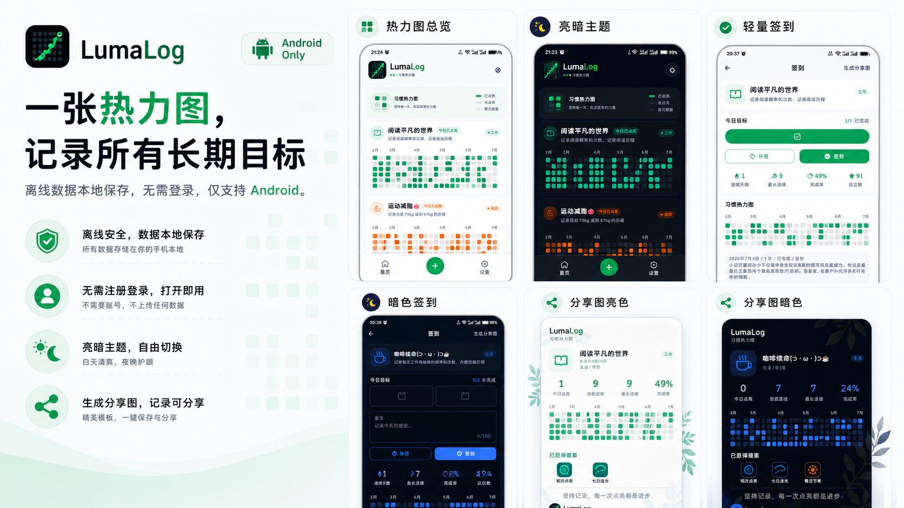
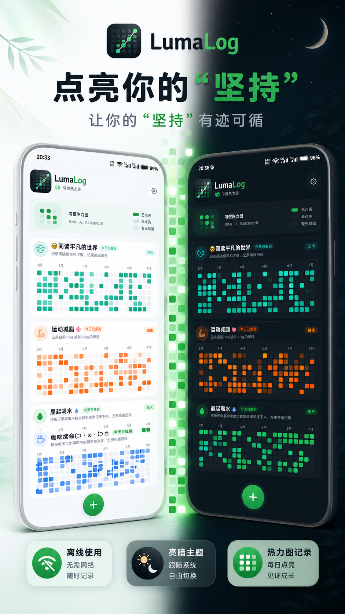
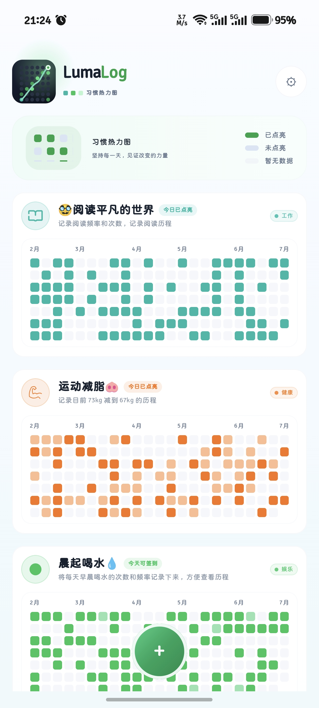
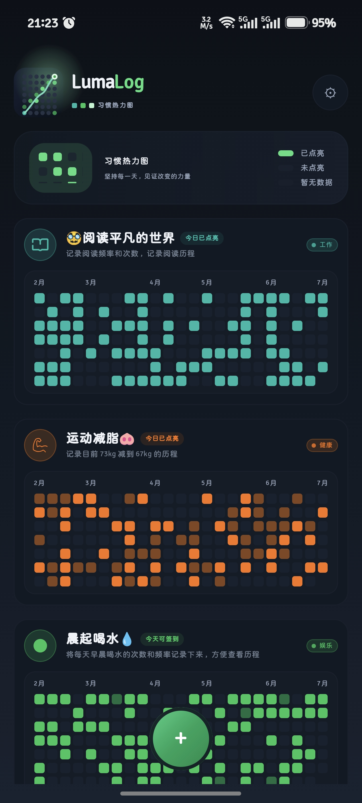
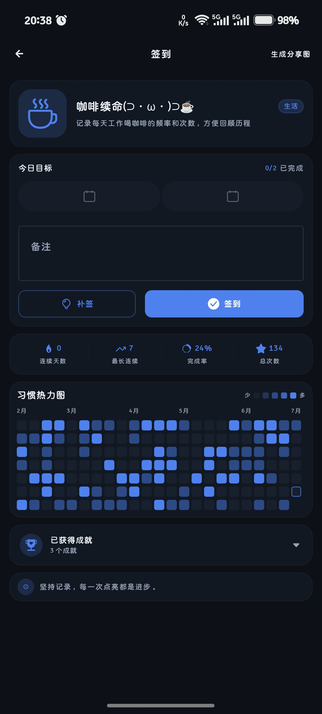
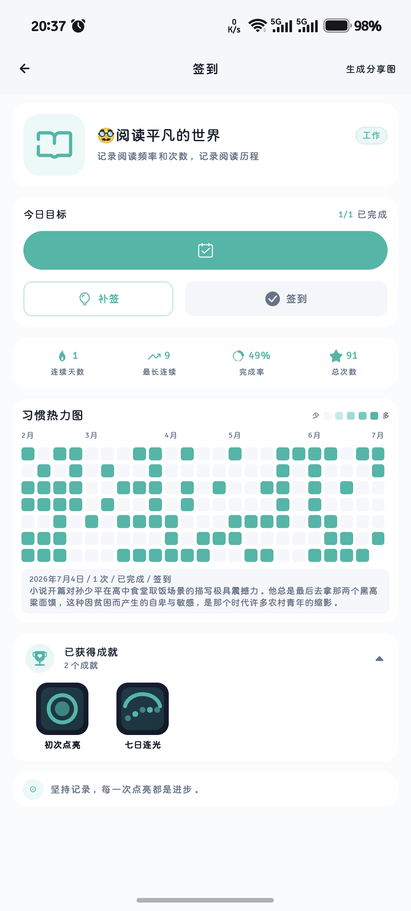
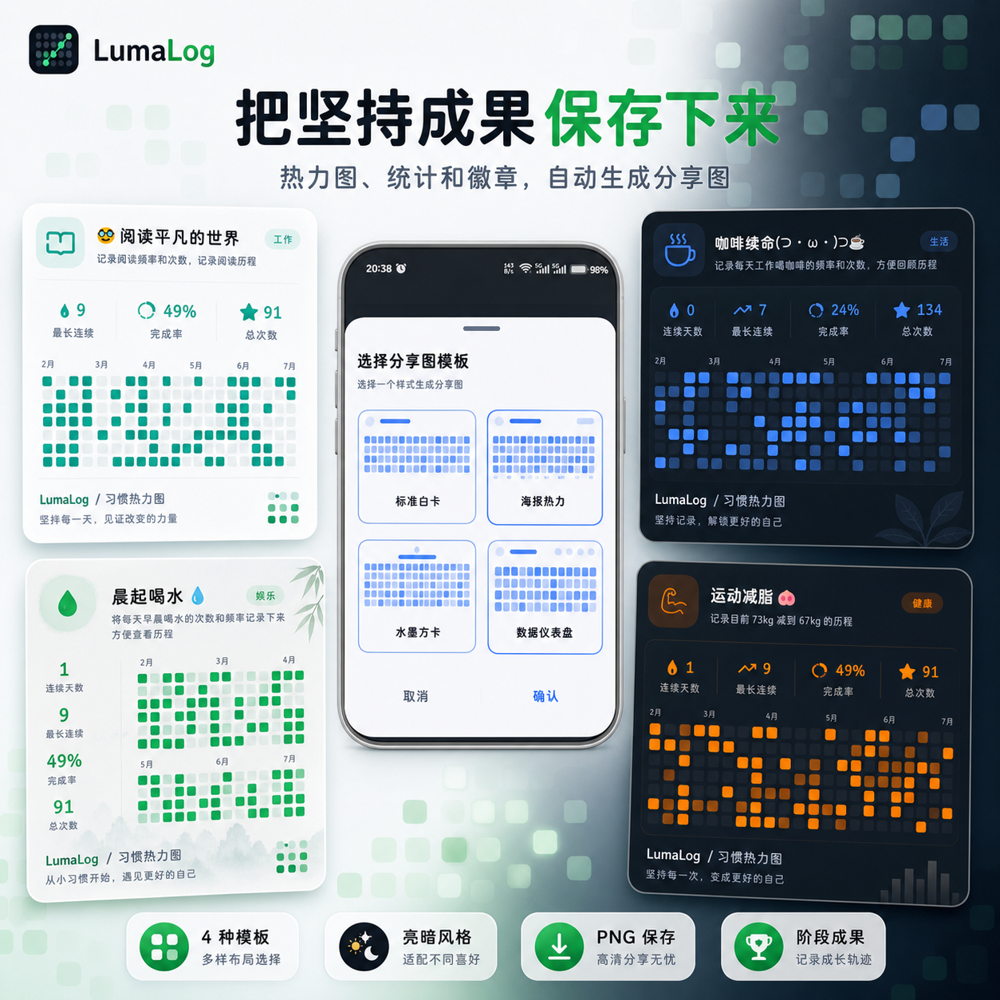
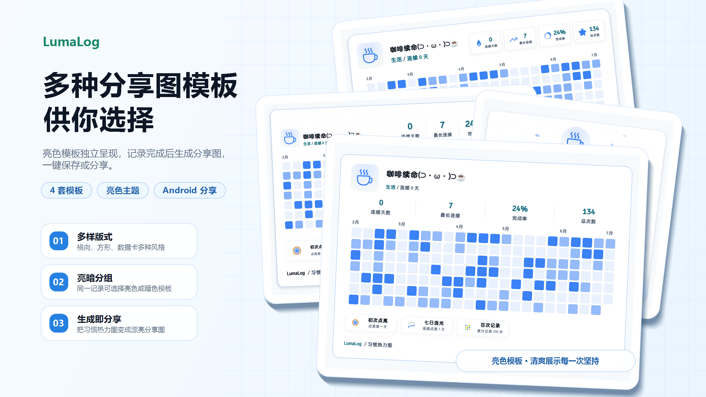
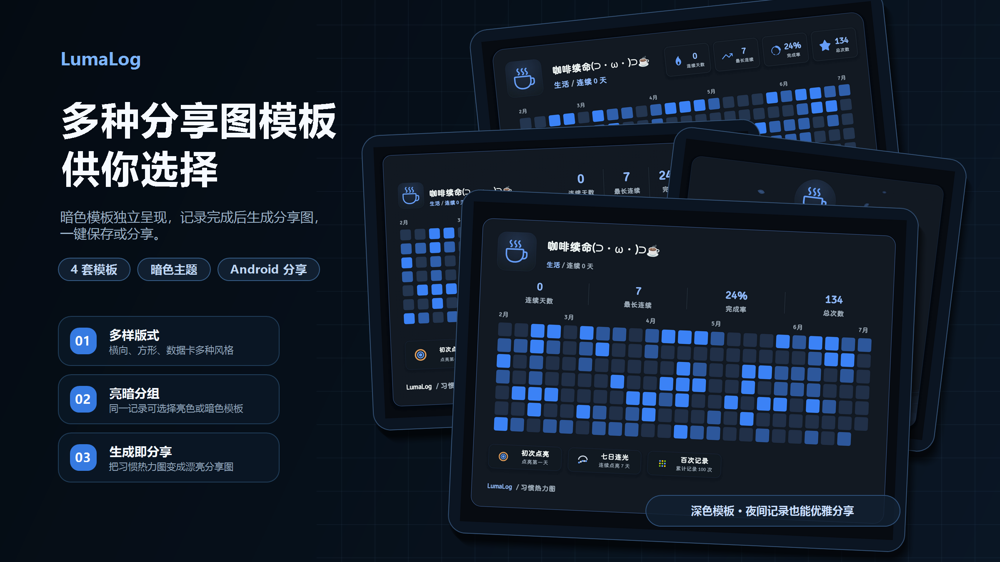
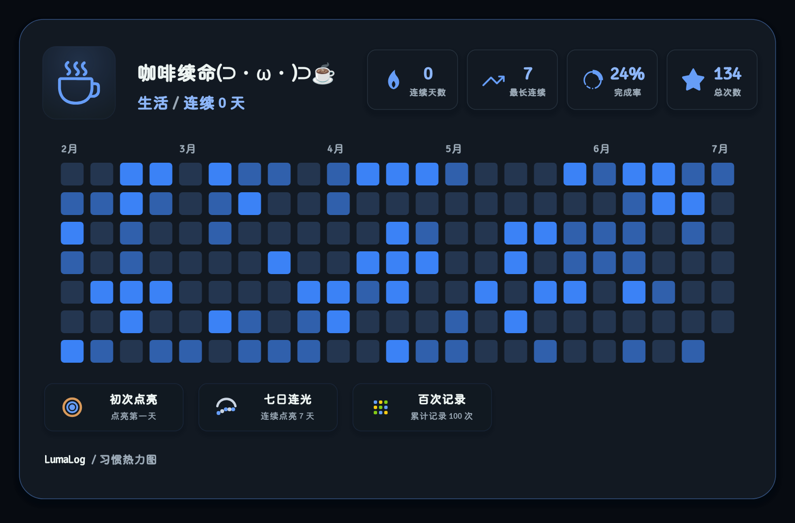

# LumaLogApp

LumaLogApp 是 LumaLog 的 Android 离线版应用。它延续 Web 端“贡献热力图”的核心视觉，把 habit 的坚持过程做成一格一格被点亮的记录：用户无需登录，也不需要连接外部数据库，即可在手机本地创建 habit、每日签到、查看热力图，并通过 JSON 文件完成数据导出与迁移。

LumaLog 的含义来自 `Luma` 与 `Log`：前者代表光与点亮，后者代表记录。这个 App 的目标也很克制：用足够轻的操作，帮助用户持续记录阅读、健身、学习、戒断、健康管理等长期目标。

## 项目预览

### 功能总览

LumaLogApp 面向 Android 设备，围绕“用一张热力图记录所有长期目标”展开。应用支持离线使用、数据本地保存、免注册登录、亮暗主题切换，以及将阶段成果生成分享图。



### 双主题主视觉

首页以 habit 卡片和贡献热力图为核心，在同一套信息结构下提供亮色与暗色两种视觉主题。用户可以快速浏览不同目标近几个月的完成情况，并通过底部按钮新建 habit。



#### 首页界面

亮色主题强调清爽、通透的浏览体验，暗色主题则降低夜间使用时的视觉刺激；两种模式均清晰区分已点亮、未点亮和暂无数据的日期状态。

| 亮色主题 | 暗色主题 |
| --- | --- |
|  |  |

### 轻量签到

签到页围绕“点亮今天”这一核心动作设计，展示今日目标、签到进度、连续天数、最长连续、完成率、总次数和完整热力图。未完成时可补签或签到，完成后则直观呈现本次记录带来的进度变化。

| 未签到（暗色） | 已签到（亮色） |
| --- | --- |
|  |  |

### 成果分享

完成记录后，可以从签到页生成成果分享图。分享图整合 habit 名称、分类、连续记录、完成率、累计次数、热力图与阶段徽章，方便保存为 PNG 或分享自己的成长轨迹。



### 分享图模板

应用内置多种分享版式，同一份记录可以根据展示场景选择横向、方形、数据卡等布局，并分别适配亮色和暗色风格。

| 亮色模板预览 | 暗色模板预览 |
| --- | --- |
|  |  |

下面是其中一组可直接生成的横向分享图示例，集中展示统计指标、贡献热力图和已获得的阶段徽章。

| 亮色分享图 | 暗色分享图 |
| --- | --- |
|  |  |

## 核心功能

- 离线使用：无需登录，无需后端服务，无需外接数据库。
- 本地持久化：habit、分类、签到记录和偏好设置保存在手机本地。
- Habit 管理：支持创建、编辑、删除 habit。
- 分类管理：内置戒断、健康、健身、学习、阅读、工作、创作、生活等分类。
- 贡献热力图：用类似 GitHub Contribution Graph 的方式展示每日签到状态。
- 签到规则：支持全天或指定时间段签到，支持每日目标次数。
- 首页模式：支持全部模式和分类模式。
- 统计显示：连续天数、最长连续、完成率、总次数、今日已点亮等信息可在设置中开关。
- 主题切换：支持亮色、暗色和跟随系统。
- 多语言：支持中文和英文。
- 数据迁移：支持导出 JSON 备份文件，也支持从 JSON 文件导入恢复。

## 技术栈

- Kotlin
- Android Gradle Plugin
- Jetpack Compose
- Material 3
- AndroidX Activity Compose
- AndroidX Lifecycle
- JSON 本地序列化
- Storage Access Framework 文件导入导出

## 本地数据

LumaLogApp 采用本地 JSON 文件持久化，不依赖 Room、SQLite 或远程数据库。默认数据文件位于应用私有目录：

```text
filesDir/lumalog-data.json
```

导出时会生成类似下面名称的备份文件：

```text
lumalog-backup-YYYY-MM-DD.json
```

该设计适合个人离线使用，也方便用户在换机或重装应用时迁移数据。

## 项目结构

```text
LumaLogApp
├─ app
│  ├─ src/main/java/com/example/lumalogapp
│  │  ├─ data             # 数据模型、本地存储、统计与签到逻辑
│  │  ├─ ui
│  │  │  ├─ components    # Logo、卡片、热力图、表单控件等通用组件
│  │  │  ├─ i18n          # 中英文文案
│  │  │  ├─ screens       # 首页、签到页、编辑页、设置页
│  │  │  ├─ theme         # Material 3 主题、颜色和字体
│  │  │  ├─ utils         # UI 辅助方法
│  │  │  └─ LumaLogApp.kt # App 导航与状态入口
│  │  └─ MainActivity.kt
│  └─ src/main/res        # 图标、主题和资源文件
├─ assets                 # README 截图、宣传图与分享模板示例
├─ build.gradle.kts
├─ settings.gradle.kts
└─ README.md
```

## 本地构建

Windows:

```bash
.\gradlew.bat assembleDebug
```

macOS / Linux:

```bash
./gradlew assembleDebug
```

生成的 Debug APK 通常位于：

```text
app/build/outputs/apk/debug/app-debug.apk
```

## 设计原则

LumaLogApp 的设计重点不是复杂的任务管理，而是让“坚持”变得可见。

- 热力图是视觉主角，卡片和控件尽量保持安静。
- 签到动作足够轻，打开 habit 后可以快速完成点亮。
- 首页信息默认克制，统计信息交给用户自行配置。
- 亮色主题清爽，暗色主题柔和，避免过重装饰。
- 数据保存在本地，让用户可以离线、私密地记录自己的长期目标。

## 关联项目

- `LumaLogFrontEnd`：基于 Vue 3 + Vite 的 Web 前端。
- `LumaLogBackEnd`：基于 Gin + PostgreSQL 的 Web 后端服务。
